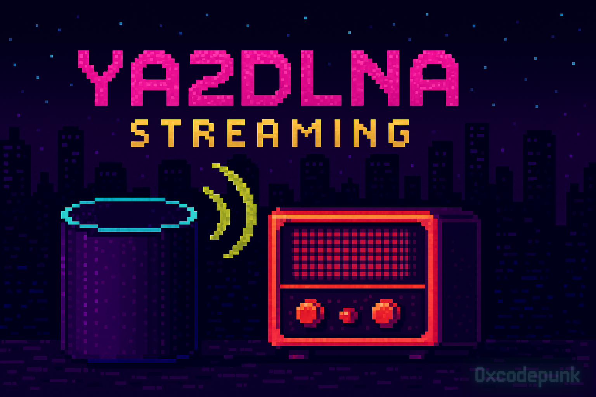

# YA2DLNA Streaming

<p align="center">
  
</p>

<p align="center">
  
  
  
</p>

Проект для стриминга контента с **Яндекс Станции** на **DLNA-совместимые устройства** и управления аудиосистемой **Ruark R5**.  

В текущей версии поддерживается **только Ruark R5**, но возможно добавление новых устройств при интересе сообщества.  

Если тебе нравится идея — [поддержи проект звёздочкой на GitHub](https://github.com/0xcodepunk/ya2dlna_streaming) ⭐️

##  Основные компоненты
Проект состоит из следующих сервисов:

- **API сервис** (`src/api`) – REST API для управления стримингом (**порт 8001**)
- **DLNA сервер** (`src/dlna_stream_server`) – потоковое вещание (**порт 8080**)
- **Основной сервис стриминга** (`src/main_stream_service`) – координация потока
- **Модуль Яндекс Станции** (`src/yandex_station`) – управление воспроизведением
- **Модуль Ruark** (`src/ruark_audio_system`) – интеграция с Ruark R5
- **Ядро** (`src/core`) – конфиги, логирование, авторизация

##  Развёртывание с Docker

###  Предварительные требования
- **Docker** и **Docker Compose**

###  Установка и запуск
```bash
git clone <repository-url>
cd ya2dlna_streaming
```

Создайте `.env` файл и настройте параметры:
```ini
# Путь к исходному коду
PYTHONPATH=src  

# Режим отладки для логирования
APP_DEBUG=False

# API токен для Яндекс.Музыки
APP_YA_MUSIC_TOKEN=your_token_here

# PIN-код Ruark (по умолчанию 1234)
APP_RUARK_PIN=1234

# Порты сервисов
APP_LOCAL_SERVER_HOST=0.0.0.0
APP_LOCAL_SERVER_PORT_DLNA=8080
APP_LOCAL_SERVER_PORT_API=8001
```

Запустите сервисы:
```bash
docker-compose up -d
```

## 🎯 API Endpoints

| Метод  | Эндпоинт     | Описание   |
|--------|--------------|------------|
| `POST` | `/stream_on` | Запуск стриминга с Яндекс Станции |
| `POST` | `/shutdown`  | Остановка стриминга |

## 💻 Локальная разработка

### 🔹 Установка зависимостей
```bash
python -m venv venv
source venv/bin/activate  # Windows: venv\Scripts\activate
pip install -r requirements.txt
```

### 🔹 Запуск сервисов
```bash
# API сервис
python -m src.api.main

# DLNA сервер
python -m src.dlna_stream_server.main
```

## ⚡ Требования
- **Python 3.11+**  
Полный список зависимостей в `requirements.txt`.

---

🎵 **YA2DLNA Streaming** – удобный способ слушать музыку с **Яндекс Станции** на **DLNA-совместимых устройствах**!  

---

📫 Есть предложения или баги? Открывай [issue](https://github.com/0xcodepunk/ya2dlna_streaming/issues) — фидбек приветствуется!

💬 Есть идеи, вопросы или просто хочешь пообщаться? Заглядывай в [обсуждение проекта](https://github.com/0xcodepunk/ya2dlna_streaming/discussions/4)!
