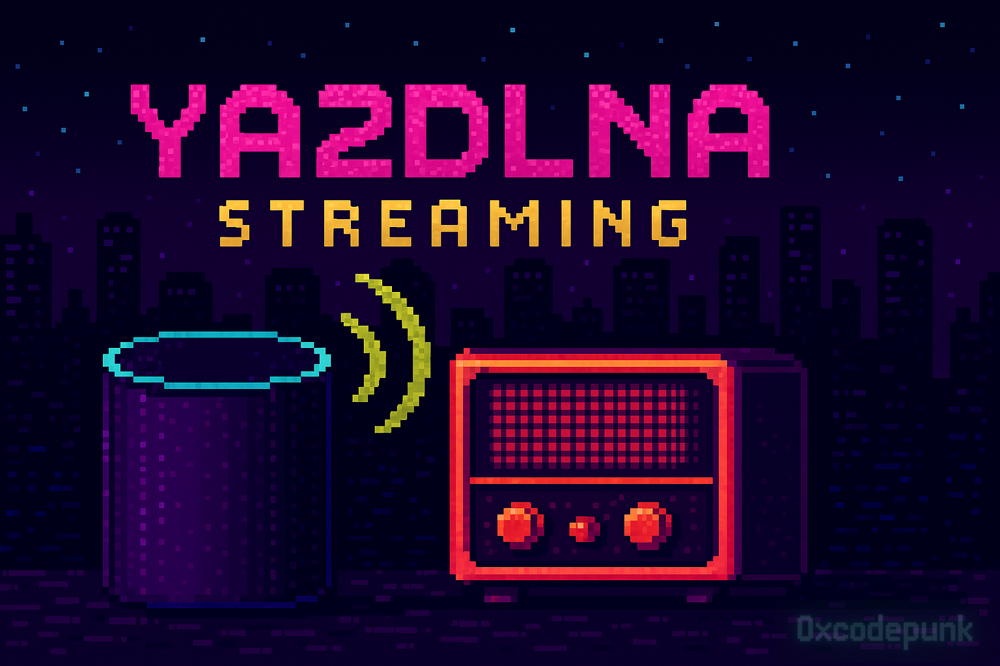

# YA2DLNA Streaming

<p align="center">
  
</p>

<p align="center">
  
  
  
  
</p>

Стриминг музыки с **Яндекс Станции** на **DLNA-совместимые устройства**. Станция превращается в пульт: всё, что играет на ней, зеркалируется на Hi-Fi систему, а сама станция замолкает и слушает команды.

В текущей версии поддерживается **Ruark R5**, но возможно добавление новых устройств при интересе сообщества. Предлагайте устройства для интеграции [в этой ветке обсуждения.](https://github.com/0xcodepunk/ya2dlna_streaming/discussions/3)

Если тебе нравится идея — [поддержи проект звёздочкой на GitHub](https://github.com/0xcodepunk/ya2dlna_streaming) ⭐️

## ✨ Возможности

- **Треки и FM-радио** Яндекс.Музыки на DLNA-устройстве в выбранном качестве
- **Полная синхронизация со станцией**: смена трека, перемотка, пауза/продолжение и повтор трека подхватываются автоматически — поток перезапускается с нужной позиции (`-ss` у FFmpeg)
- **Включение стрима посреди трека** — воспроизведение продолжается с текущей позиции станции, а не с начала
- **Дакинг**: когда Алиса говорит или слушает, громкость устройства приглушается и плавно возвращается после
- **Метаданные на дисплее**: исполнитель и название трека (или имя радиостанции) вместо «Internet Radio»
- **Память громкости** между сеансами стриминга: устройство включается с той громкостью, на которой его выключили
- **Событийная реакция**: изменения на станции прилетают push-сообщениями по WebSocket, а не опросом
- **Интеграция с умным домом**: эндпоинты дёргаются сценариями Алисы — «Алиса, включи стрим» запускает всю цепочку

## 🏗 Архитектура

```
Яндекс Станция ◀──WebSocket──▶ API-сервис :8001 (MainStreamManager)
      │                              │ POST /set_stream
      │ mDNS-поиск                   ▼
      │                    DLNA-сервер :8080 (FFmpeg → pipe)
      │                              │ GET /live_stream.mp3
      ▼                              ▼
   Протокол glagol             Ruark R5 (UPnP AVTransport + fsapi)
```

| Компонент | Путь | Назначение |
|-----------|------|------------|
| **API-сервис** (:8001) | `src/api` | REST для умного дома, цикл управления стримингом |
| **DLNA-сервер** (:8080) | `src/dlna_stream_server` | FFmpeg-поток и раздача `/live_stream.mp3` |
| **Координатор** | `src/main_stream_service` | Слежение за станцией, ресинк, дакинг, громкость |
| **Модуль станции** | `src/yandex_station` | WebSocket-клиент, mDNS-поиск, protobuf-состояние |
| **Модуль Ruark** | `src/ruark_audio_system` | UPnP-транспорт, fsapi (питание), память громкости |
| **Ядро** | `src/core` | Конфигурация, DI, логирование, токены |

## 🎯 API

**API-сервис (:8001)** — интерфейс для умного дома:

| Метод | Эндпоинт | Описание |
|-------|----------|----------|
| `POST` | `/stream_on` | Запуск стриминга со станции |
| `POST` | `/shutdown` | Остановка стриминга и выключение устройства |

**DLNA-сервер (:8080)** — внутренний API потока:

| Метод | Эндпоинт | Описание |
|-------|----------|----------|
| `POST` | `/set_stream` | Запуск потока: `yandex_url`, `radio`, `start_position`, `title`, `artist` |
| `GET/HEAD` | `/live_stream.mp3` | Аудиопоток для DLNA-устройства |
| `POST` | `/stop_stream` | Остановка потока |

## 🚀 Развёртывание с Docker

### Предварительные требования
- **Docker** и **Docker Compose**

### Установка и запуск
```bash
git clone https://github.com/0xcodepunk/ya2dlna_streaming.git
cd ya2dlna_streaming
```

Создайте `.env` файл и настройте параметры:
```ini
# Путь к исходному коду
PYTHONPATH=src

# Режим отладки для логирования
APP_DEBUG=False

# API токен для Яндекс.Музыки
APP_YA_MUSIC_TOKEN=your_token_here

# PIN-код Ruark (по умолчанию 1234)
APP_RUARK_PIN=1234

# Адрес и порты сервисов (адрес — IP машины в локальной сети)
APP_LOCAL_SERVER_HOST=192.168.1.10
APP_LOCAL_SERVER_PORT_DLNA=8080
APP_LOCAL_SERVER_PORT_API=8001

# Качество потока, kbps (64/128/192/320)
APP_STREAM_QUALITY=320

# Необязательно: постоянная папка для логов и кеша вне рабочей директории
# YA2DLNA_DATA_DIR=/opt/ya2dlna-data
```

Запустите сервисы:
```bash
docker compose up -d
```

> Сервисы работают с `network_mode: host` — DLNA-устройство должно быть в той же локальной сети, а `APP_LOCAL_SERVER_HOST` указывать на адрес хоста, доступный устройству.

## ⚙️ CI/CD

Каждый pull request проходит проверки на GitHub-hosted раннере: `black`, `isort`, `flake8`, `mypy` (strict-уровень) и `pytest`. Пуш в `main` дополнительно запускает деплой на self-hosted раннере: сборка образов, перезапуск `docker compose` и healthcheck обоих сервисов. Конфигурация — в [`.github/workflows/ci-cd.yml`](.github/workflows/ci-cd.yml).

## 💻 Локальная разработка

### Установка зависимостей
```bash
python -m venv .venv
source .venv/bin/activate  # Windows: .venv\Scripts\activate
pip install -r requirements-dev.txt
```

### Запуск сервисов
```bash
# API сервис
python -m src.api.main

# DLNA сервер
python -m src.dlna_stream_server.main
```

### Проверки перед коммитом
```bash
./.venv/bin/python -m black src tests
./.venv/bin/python -m isort src tests
./.venv/bin/python -m flake8 .
./.venv/bin/python -m mypy
./.venv/bin/python -m pytest
```

## ⚡ Требования
- **Python 3.11+**
- **FFmpeg**
- DLNA-устройство в локальной сети

---

🎵 **YA2DLNA Streaming** – удобный способ слушать музыку с **Яндекс Станции** на **DLNA-совместимых устройствах**!

---

📫 Есть предложения или баги? Открывай [issue](https://github.com/0xcodepunk/ya2dlna_streaming/issues) — фидбек приветствуется!

💬 Есть идеи, вопросы или просто хочешь пообщаться? Заглядывай в [обсуждение проекта](https://github.com/0xcodepunk/ya2dlna_streaming/discussions/4)!